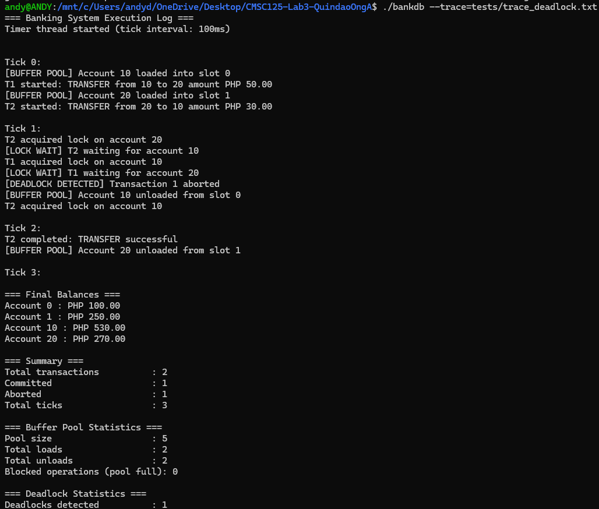
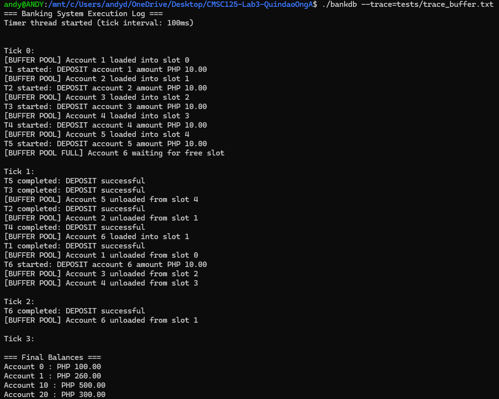
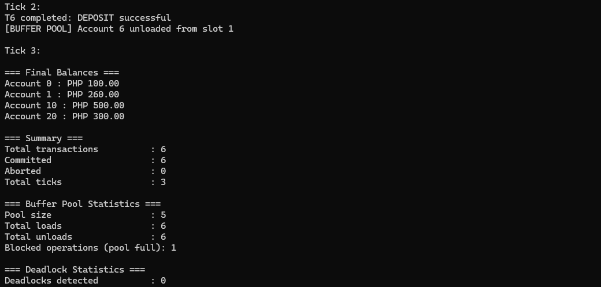
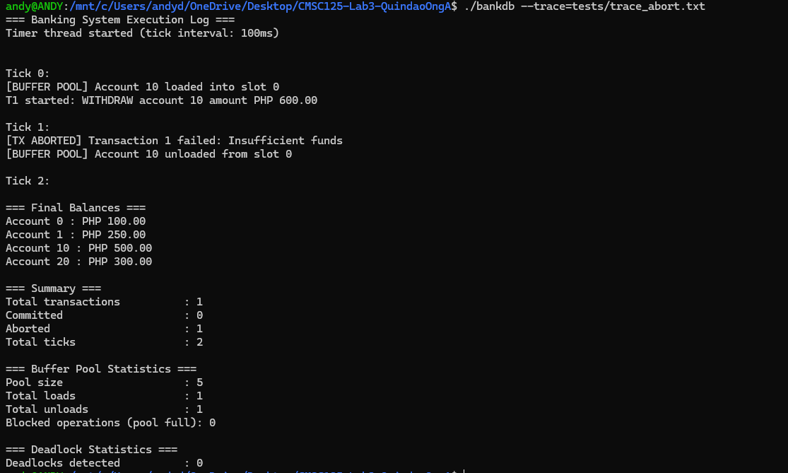
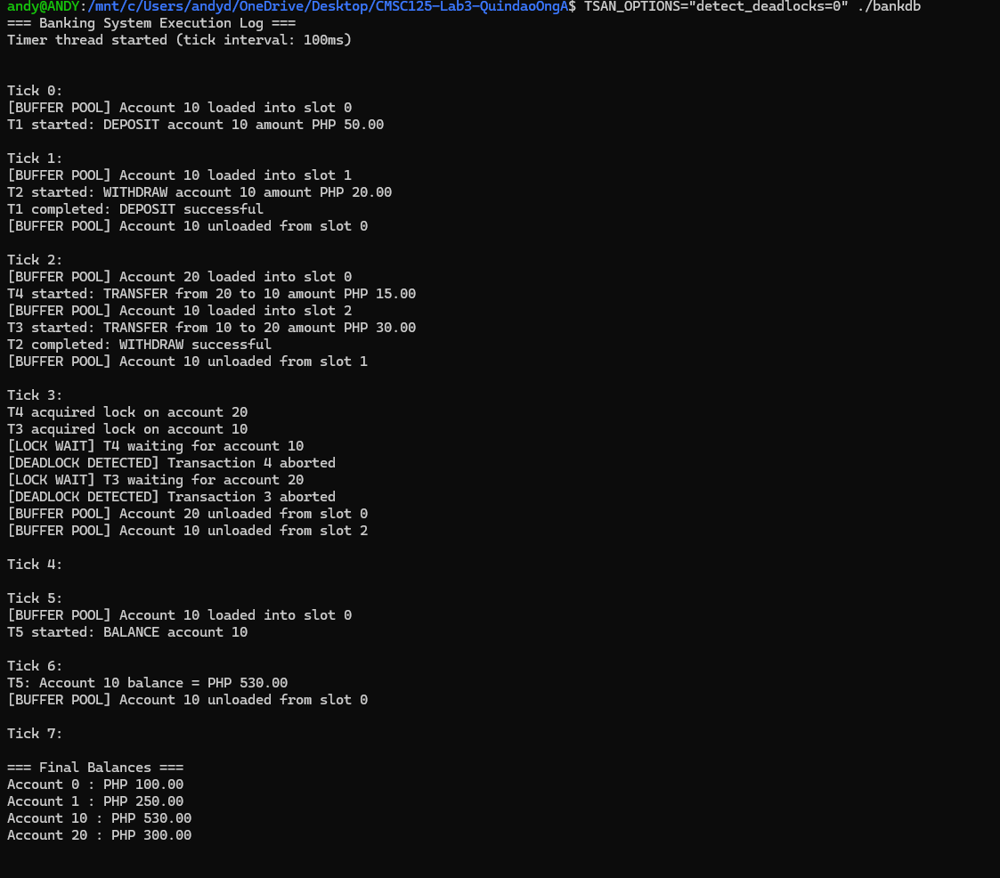
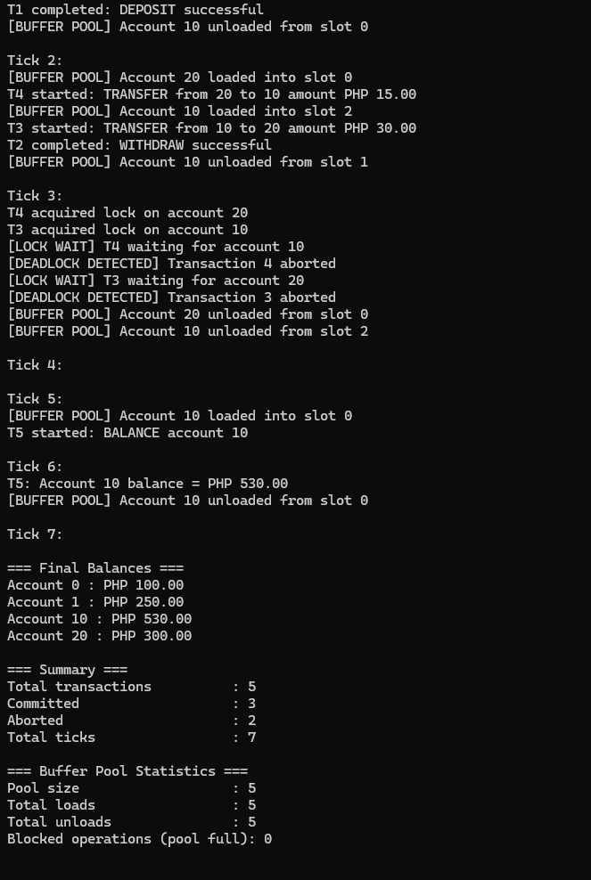

# Design Justifications

## 1. Synchronization Design

The banking simulator uses fine-grained synchronization through per-account reader-writer locks.

Each account maintains its own `pthread_rwlock_t` lock, allowing multiple readers while ensuring exclusive access for writers.

Reader-writer locks were chosen instead of regular mutexes because banking systems typically have more read operations than write operations, allowing better concurrency for balance inquiries.

Reader locks are used for balance inquiries while writer locks are used for:

* deposits
* withdrawals
* transfers

Additional mutexes protect shared global structures such as:

* metrics
* wait-for graph
* global tick

Condition variables are used for timer synchronization between transaction threads and the timer thread.

This design minimizes contention while ensuring thread safety across concurrent transactions.

---

## 2. Deadlock Handling

The simulator implements deadlock detection using a wait-for graph.

When a transaction cannot acquire a lock, a dependency edge is added to the graph representing which transaction is waiting for another transaction.

Depth-First Search (DFS) is used to detect cycles in the graph.

A cycle occurs when transactions are waiting on each other in a circular manner.

For example:

* Transaction 1 waits for Transaction 2
* Transaction 2 waits for Transaction 1

Since neither transaction can continue, the system becomes deadlocked.

If a cycle is detected:

* one transaction is aborted
* acquired locks are released
* wait-for graph entries are cleared

This allows the system to recover from circular wait conditions without permanently blocking transactions.

Deadlock detection was chosen instead of deadlock prevention because it allows higher concurrency and more realistic database behavior.

Unlike prevention techniques, deadlock detection allows transactions to acquire locks freely and only intervenes when an actual deadlock occurs.

---

## 3. Reader-Writer Lock Performance

The simulator uses `pthread_rwlock_t` instead of regular mutex locks for account synchronization.

Reader-writer locks allow multiple transactions to read the same account simultaneously while still ensuring exclusive access for write operations.

This improves concurrency for read-heavy workloads because BALANCE operations do not block each other.

The largest improvement is observed in the `trace_readers.txt` workload, where multiple BALANCE transactions execute concurrently on the same account.

If regular `pthread_mutex_t` locks were used instead, all reader transactions would execute one at a time, reducing concurrency and increasing waiting time.

Using reader-writer locks improves performance by allowing:

* concurrent balance inquiries
* reduced lock contention
* better throughput for read-heavy workloads

Writer operations such as:

* DEPOSIT
* WITHDRAW
* TRANSFER

still acquire exclusive write locks to preserve account consistency during balance updates.

This design provides a balance between concurrency and correctness for banking transactions.
---

## 4. Buffer Pool Design

The simulator models limited database memory using a bounded buffer pool.

Accounts are loaded into the buffer pool whenever a transaction begins accessing an account during an operation such as:

* DEPOSIT
* WITHDRAW
* TRANSFER
* BALANCE

The `load_account()` function is responsible for placing the requested account into an available buffer slot before the transaction proceeds.

Accounts are unloaded after the transaction operation completes using the `unload_account()` function, freeing the slot for future transactions.

The buffer pool uses POSIX semaphores:

* `empty_slots` tracks available slots
* `full_slots` tracks occupied slots

Semaphores were chosen because they naturally model resource availability and blocking behavior in bounded buffer systems.

If the buffer pool becomes full, transactions attempting to load additional accounts are blocked until another transaction unloads a slot.

This behavior simulates realistic database systems where memory pages are limited and transactions must wait for available resources.

The design improves correctness by ensuring that only a limited number of accounts may occupy the buffer pool simultaneously, preventing resource over-allocation.

Performance is improved because transactions can continue concurrently while synchronization primitives safely coordinate buffer access between threads.

Mutex protection is also used during slot allocation and release operations to ensure thread-safe updates to shared buffer pool metadata.

---

## 5. Timer and Metrics System

A dedicated timer thread maintains the global simulation clock.

The timer thread periodically increments the global tick value and signals waiting transaction threads using a condition variable.

A separate timer thread was chosen to simulate realistic concurrent transaction scheduling where multiple transactions may begin execution at different ticks while running simultaneously.

Transactions wait until their assigned start tick before executing operations.

Without a dedicated timer thread, operations would execute sequentially, removing true concurrency from the simulation.

This would prevent realistic testing of:

* deadlocks
* lock contention
* concurrent reads and writes
* buffer pool blocking

The timer thread enables true concurrency testing because multiple transaction threads can wake up and compete for resources at the same simulation tick.

This creates realistic synchronization scenarios where transactions overlap in execution.

The simulator also records runtime metrics including:

* committed transactions
* aborted transactions
* total simulation ticks
* throughput
* deadlock statistics
* buffer pool statistics
* transaction execution timing

Metrics are protected using mutex synchronization to ensure thread-safe updates across concurrent transaction threads.

At the end of execution, the metrics system prints a summary of simulator behavior and transaction outcomes.

---

## 6. Execution Logging

The simulator includes detailed execution logging to visualize concurrent transaction behavior.

Logs include:

* transaction start and completion
* lock acquisition
* deadlock detection
* transaction aborts
* buffer pool activity

Execution logs help verify synchronization correctness and provide visibility into concurrent execution order.

The logging system was designed primarily for debugging, testing, and demonstrating concurrency behavior during execution.

---
## 7. Screenshots

### Deadlock Handling

### Buffer Pool Saturation Screenshot

### Balance Conservation Screenshot

### ThreadSanitizer 

##### ThreadSanitizer Note
The simulator intentionally allows circular waits so that deadlock detection and recovery can be demonstrated.ThreadSanitizer reports lock-order inversion because deadlocks are intentionally created during testing. The warning was suppressed only for validation screenshots after verifying synchronization correctness.

